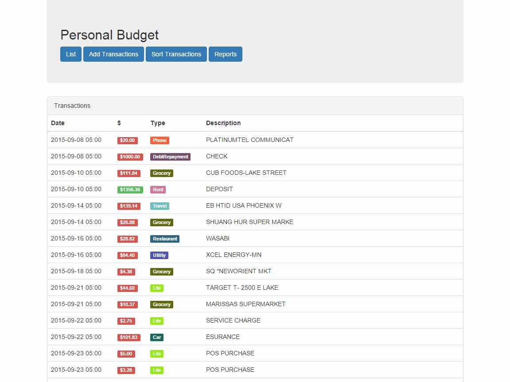

# JavaWebApp

  - Install JDK 8
  - Install Glassfish 4 && run it
  - Install Glassfish Tools For Eclipse
  - eclipse > Window > Show View > Servers
  - Add the glassfish server
  - download protoc version 2 and place it in the tools folder. 
    - (if you arent on windows you might have to change the ant build in the tools folder since it references protoc.exe)
  - Project > Build All

```
cd ./Client
npm install
jspm install
gulp
```

Right click on project and select "Run on Server"


## Import from your bank


## Categorize your transactions


## List transactions


## Interactive reporting 

